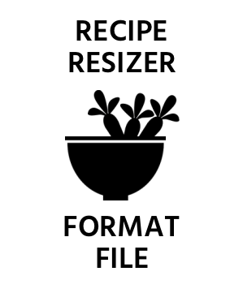

<!-- Begin README -->

<div align="center">
    <a href="https://github.com/Night-Owl-Labs/Recipe-Resizer-File-Format" target="_blank">
        
    </a>
</div>
<br>
<p align="center">
    <a href="https://www.json.org/json-en.html"></a>
    <br>
    <a href="https://github.com/Night-Owl-Labs"></a>
    <a href="https://x.com/reciperesizer"></a>
    <a href="mailto:support@reciperesizer.com"></a>
    <br>
    <a href="https://prgportfolio.com" target="_blank"></a>
</p>

---------------

<h1 align="center">🧑‍🍳 🥕 Recipe Resizer File Format 🍅 🥬</h1>

The **Recipe Resizer File Format** is a proprietary file type (`.reciperesizer` extension) used by the **Recipe Resizer** app for importing and exporting recipes. These files are `JSON`-based and designed for easy sharing, syncing, and backup of recipe data within the app.

<div align="center">
<table>
    <tr>
        <h3 align="center">Download Recipe Resizer on the Apple App Store</h3>
        <td align="center">
            <h3 align="center">Download Recipe Resizer on the Apple App Store</h3>
            <a href="https://apps.apple.com/app/id6450848695"></a>
            <!-- <a href="https://apps.apple.com/app/id6450848695"></a> -->
        </td>
    </tr>
</table>
</div>

---------------

## Table of Contents

- [File Structure](#file-structure)
    - [Example](#example)
    - [Field Definitions](#field-definitions)
        - [Root Object](#root-object)
        - [Recipe Metadata](#recipe-metadata)
        - [Servings](#servings)
        - [Time Estimates](#time-estimates)
        - [Source](#source)
        - [Verification](#verification)
        - [Ingredients](#ingredients)
        - [Directions](#directions)
        - [Notes](#notes)
- [Importing](#importing)
- [Exporting](#exporting)
- [Why Use This File Format?](#why-use-this-file-format)
- [Developer Notes](#developer-notes)
- [Disclaimer](#disclaimer)
- [License](#license)
- [Credits](#credits)

## File Structure

The file contains an array of recipe or recipes, each with its own metadata, ingredients, directions, and other relevant information.

### Example

```json
{
  "recipes" : [
    {
      "recipe" : {
        "name" : "Very Berry Lemon Cake",
        "description" : "A zesty lemon cake layered with creamy frosting and loaded with fresh, juicy berries for a bright, flavorful treat.",
        "category" : "Dessert",
        "system" : "Imperial",
        "servings" : {
          "to" : 0,
          "from" : 8
        },
        "times" : {
          "total" : {
            "hours" : 1,
            "minutes" : 15
          },
          "cook" : {
            "hours" : 1,
            "minutes" : 0
          },
          "prep" : {
            "hours" : 0,
            "minutes" : 15
          }
        },
        "source" : {
          "author" : "Team Recipe Resizer",
          "website" : "https:\/\/reciperesizer.com",
          "image" : "",
          "video" : "",
          "link" : ""
        },
        "verification" : {
          "verifiedID" : "",
          "verifiedSignature" : "",
          "verified" : false
        },
        "directions" : [
          {
            "steps" : [
              "1. Preheat oven to 355 °F (180 °C).",
              "2. Line the bottoms of two 9\" cake pans with parchment paper, no butter or oil needed.",
              "3. Beat 7 eggs on high speed using the whisk attachment for a minute or two. With the mixer still running, gradually add 1 cup of sugar and continue beating until fluffy and thick, about 10 minutes."
            ]
          }
        ],
        "notes" : [

        ],
        "ingredients" : [
          {
            "quantity" : "7",
            "sequence" : 1,
            "measurementUnit" : "Each",
            "quantityRange" : "",
            "resizedSequence" : 0,
            "measurementType" : "Other",
            "measurementUnitAbv" : "ech",
            "type" : "O",
            "name" : "large eggs"
          },
          {
            "quantity" : "2",
            "sequence" : 2,
            "measurementUnit" : "Cups",
            "quantityRange" : "",
            "resizedSequence" : 0,
            "measurementType" : "Dry",
            "measurementUnitAbv" : "cup",
            "type" : "O",
            "name" : "sugar"
          }
          // Shortened for brevity
        ]
      }
    }
  ]
}
```

> [!NOTE]
> You can find example `.reciperesizer` and `.json` files in the repository's [examples](examples) directory.

## Field Definitions

Below is a summary of the file structure and field definitions used in the file.

### Root Object

| Field Path                              | Type             | Description |
|-----------------------------------------|------------------|-------------|
| `recipes`                               | Array            | Root array containing one or more recipes. |
| `recipes[].recipe`                      | Object           | The actual recipe object. |

### Recipe Metadata

| Field Path                              | Type             | Description |
|-----------------------------------------|------------------|-------------|
| `recipe.name`                           | String           | Title of the recipe (Required). |
| `recipe.description`                    | String           | Short description of the recipe. |
| `recipe.category`                       | String           | Category like "Dessert", "Chicken", etc. |
| `recipe.system`                         | String           | Measurement system: "Imperial", "Metric", or "Combination" (Required). |

### Servings

| Field Path                              | Type             | Description |
|-----------------------------------------|------------------|-------------|
| `recipe.servings.from`                  | Int              | From servings (Original Quantity) (Required). |
| `recipe.servings.to`                    | Int              | To servings (Resized Quantity). |

### Time Estimates

| Field Path                              | Type             | Description |
|-----------------------------------------|------------------|-------------|
| `recipe.times.total.hours`             | Int              | Total time (hours). |
| `recipe.times.total.minutes`           | Int              | Total time (minutes). |
| `recipe.times.cook.hours`              | Int              | Cook time (hours). |
| `recipe.times.cook.minutes`            | Int              | Cook time (minutes). |
| `recipe.times.prep.hours`              | Int              | Prep time (hours). |
| `recipe.times.prep.minutes`            | Int              | Prep time (minutes). |

### Source

| Field Path                              | Type             | Description |
|-----------------------------------------|------------------|-------------|
| `recipe.source.author`                 | String           | Author of the recipe. |
| `recipe.source.website`                | String           | Name of the website. |
| `recipe.source.image`                  | String           | Image URL (optional). |
| `recipe.source.video`                  | String           | Video URL (optional). |
| `recipe.source.link`                   | String           | Link to original source. |

### Verification

> [!NOTE]
> This section is for **Team Recipe Resizer** created recipes. It is not used for user-generated recipes.

| Field Path                              | Type             | Description |
|-----------------------------------------|------------------|-------------|
| `recipe.verification.verifiedID`       | String           | ID of the signer or source. |
| `recipe.verification.verifiedSignature`| String           | Cryptographic signature value. |
| `recipe.verification.verified`         | Boolean          | Whether recipe should be checked for verification. |

### Ingredients

| Field Path                              | Type             | Description |
|-----------------------------------------|------------------|-------------|
| `recipe.ingredients[]`                 | Array of Objects | List of ingredients (At least one required). |
| `recipe.ingredients[].quantity`        | String / Double  | Quantity (e.g., "1 1/2" or 1.5) (Required). |
| `recipe.ingredients[].measurementUnit` | String           | Full unit name (e.g., "Teaspoon") (Required). |
| `recipe.ingredients[].measurementUnitAbv` | String        | Abbreviated unit (e.g., "tsp") (Required). |
| `recipe.ingredients[].measurementType` | String           | "Dry", "Liquid", or "Other" (Required). |
| `recipe.ingredients[].name`            | String           | Name of the ingredient (Required). |
| `recipe.ingredients[].sequence`        | Int              | Order in which it appears (Required). |
| `recipe.ingredients[].type`            | String           | "O" = "Original", "R" = "Resized" (Required). |
| `recipe.ingredients[].quantityRange`   | Object           | Ranged quantity object (Optional). |
| `recipe.ingredients[].resizedSequence` | Int              | Used to order multiple resized quantities and units (Optional). |

### Directions

| Field Path                              | Type             | Description |
|-----------------------------------------|------------------|-------------|
| `recipe.directions[]`                  | Array of Objects | Groups of steps. |
| `recipe.directions[].steps[]`          | Array of Strings | List of instructions. |

### Notes

| Field Path                              | Type             | Description |
|-----------------------------------------|------------------|-------------|
| `recipe.notes[]`                       | Array of Strings | Freeform notes. |

## Importing

*To import a `.reciperesizer` file:*

1. Open the **Recipe Resizer** app.
2. Tap the plus sign in the upper right hand corner.
3. Choose **Recipe Resizer File Format**.
3. Select a `.reciperesizer` file from your device or cloud storage.
4. The app will parse and display the recipe.
5. Review the recipe details and tap the checkmark to save it to your cookbook.

## Exporting

*To export a recipe to a `.reciperesizer` file:*

1. Select the recipe you want to export.
2. Tap **Export**.
3. Choose **Recipe Resizer File Format**.
4. The file will be saved and ready to share or back up.

## Why Use This File Format?

- **Portable**: Encapsulates all recipe details in a single file.
- **Verifiable**: Optional signature adds integrity and source validation.
- **Readable**: Based on `JSON`, making it developer- and human-friendly.
- **Structured**: Organized metadata ensures consistent handling across devices.

## Developer Notes

While the `.reciperesizer` format is proprietary, it uses standard `JSON` syntax, which makes it easy to read with common parsers.

> [!WARNING]
> Modifying the contents of a verified recipe without recalculating a valid signature may result in the file being treated as unverified or rejected upon import.

## Disclaimer

The `.reciperesizer` format is the intellectual property of **Night Owl Labs, LLC**. It is designed solely for use with the **Recipe Resizer** app. Compatibility with third-party applications is not officially supported but can be developed by you if .

The `.reciperesizer` format is the intellectual property of **Night Owl Labs, LLC.** and is designed exclusively for use with the **Recipe Resizer** app. While compatibility with third-party applications is not officially supported, developers are free to implement their own solutions. Please read our [Terms and Conditions](https://reciperesizer.com/docs/terms.html) for more information.

## License

This project is released under the terms of the **MIT License**, which permits use, modification, and distribution of the code, subject to the conditions outlined in the license.
- The [MIT License](https://choosealicense.com/licenses/mit/) provides certain freedoms while preserving rights of attribution to the original creators.
- For more details and to understand all requirements and conditions, see the [LICENSE](docs/LICENSE/MIT/LICENSE) file in this repository.

## Credits

**Author:** [Scott Grivner](https://github.com/scottgriv) <br>
**Email:** [scott.grivner@gmail.com](mailto:scott.grivner@gmail.com) <br>
**Website:** [scottgrivner.dev](https://www.scottgrivner.dev) <br>
**Reference:** [Main Branch](https://github.com/Night-Owl-Labs/Recipe-Resizer-File-Format) <br>

---------------

<div align="center">
    <a href="https://reciperesizer.com" target="_blank">
        
    </a>
  <br>
  <br>
    <a href="https://nightowllabs.io" target="_blank">
        
    </a>
</div>

<!-- End README -->
